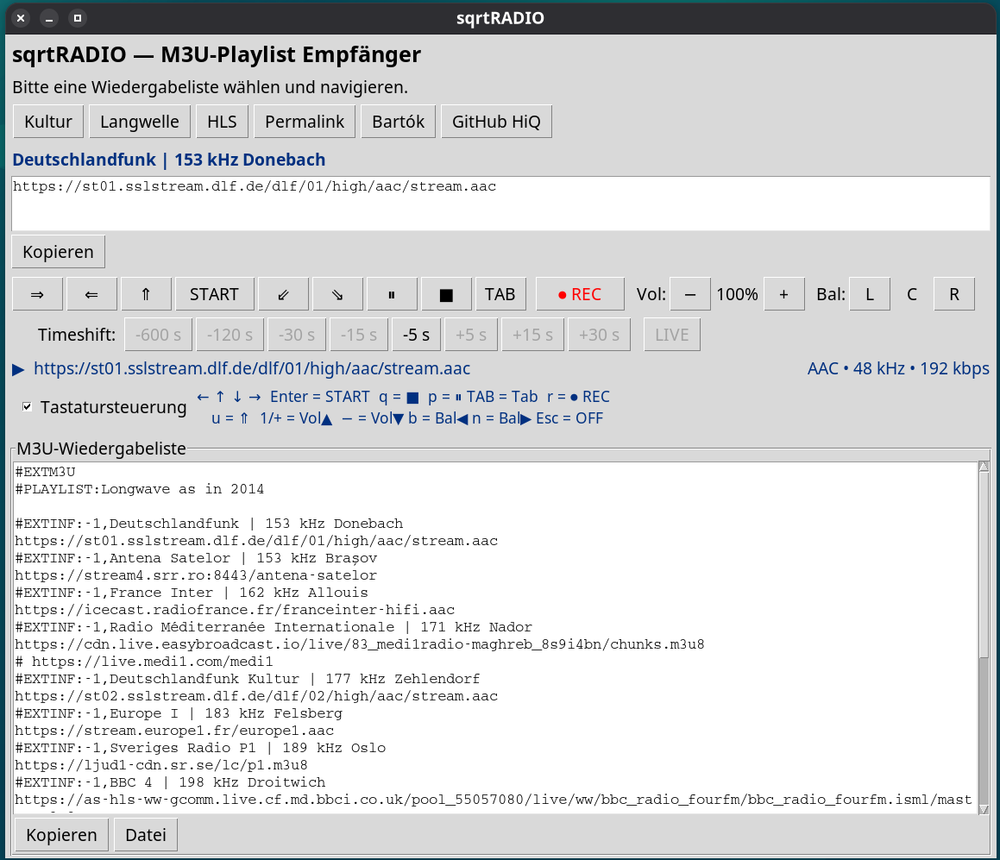

# sqrtRADIO

**English** | [Deutsch](#deutsch)

---

## 🎙️ Play Any Radio Stream — HLS, Icecast, MP3, and More

sqrtRADIO is a Python-based M3U playlist radio player with advanced timeshift capabilities for DVR (Digital Video Recording) streams and Icecast/HTTP radio stations. It replicates the functionality of [m3u.js](https://www.sqrt.ch/Radio/m3u) with a full-featured GUI.

### Features

- **M3U Playlist Support** – Load HLS, Icecast, MP3, AAC, and other audio streams from M3U playlists
- **HLS/DVR Playback** – Play live HLS streams with optional timeshift and rewind capabilities
- **Advanced Timeshift** – Rewind/fast-forward on streams that support DVR windows
- **Client-Side Buffering** – Icecast streams can be rewound up to 10 minutes using a local ring buffer
- **Volume & Balance Control** – Adjust left/right balance and volume in real-time
- **Stream Recording** – Record any stream to MKV, MP3, AAC, OPUS, FLAC, OGG or other formats
- **Pause/Resume** – Pause playback while maintaining stream state
- **Keyboard Shortcuts** – Full keyboard control for navigation and playback
- **Preset Playlists** – Quick access to curated Swiss radio stations and international feeds

### Requirements

- **Python 3.10+**
- **FFmpeg** – [Download from ffmpeg.org](https://ffmpeg.org/download.html)
- Python packages: `requests`, `sounddevice`, `numpy`

### Installation

1. **Install FFmpeg**
   - **macOS**: `brew install ffmpeg`
   - **Ubuntu/Debian**: `sudo apt-get install ffmpeg`
   - **Windows**: Download from [ffmpeg.org](https://ffmpeg.org/download.html) and add to PATH

2. **Install Python Dependencies**
   ```bash
   pip install requests sounddevice numpy
   ```

3. **Run sqrtRADIO**
   ```bash
   python sqrtRADIO.py
   ```

### Usage

#### Basic Playback
1. Select a preset playlist (Kultur, Langwelle, HLS, etc.) or load your own M3U file
2. Click **START** to play the selected station
3. Use arrow keys (← →) to navigate through stations
4. Click **■** (or press **Q**) to stop playback

#### Timeshift (DVR Streams)
- Use the **Timeshift** buttons to rewind/fast-forward in supported streams
- **-600 s** to **-5 s**: Rewind buttons
- **+5 s** to **+600 s**: Fast-forward buttons
- **LIVE**: Return to the live edge

#### Keyboard Controls
| Key | Action |
|-----|--------|
| ← / → | Previous/Next Station |
| ↑ / ↓ | First/Last Station |
| Enter | START playback |
| Q | Stop (■) |
| P | Pause/Resume (⏸) |
| TAB | Open URL in browser |
| U | Go back in history (⇑) |
| R | Toggle Recording (⏺) |
| 1 / + | Volume up |
| − | Volume down |
| B | Balance left |
| N | Balance right |
| Esc | Disable keyboard control |

#### Recording
1. Click **⏺ REC** while a stream is playing
2. Choose your preferred audio format (MKV, MP3, AAC, etc.)
3. Select save location
4. Click **⏹ STOP** to end recording

#### Volume & Balance
- Use **Vol +/−** buttons or keyboard shortcuts to adjust volume
- Use **Bal L/R** buttons to pan between left and right channels

### Preset Playlists Examples

- **Kultur** – Swiss and international cultural radio stations
- **Langwelle** – Nostalgic LW playlist
- **HLS** – HLS/DVR-capable streams
- **Permalink** – Simple URL-per-line format
- **Bartók** – Playlist from the radio station
- **GitHub HiQ** – High-quality international radio stations (via GitHub)

### Technical Details

#### HLS Adaptive Streaming
sqrtRADIO automatically selects the **highest-bandwidth variant** from master playlists, ensuring the best audio quality (similar to VLC behavior).

#### DVR Detection
The player automatically detects DVR capabilities by:
1. Parsing HLS manifests for `#EXT-X-PLAYLIST-TYPE:EVENT` or `#EXT-X-PLAYLIST-TYPE:VOD` tags
2. Checking total segment duration (>90 seconds indicates DVR)
3. Falling back to `ffprobe` for non-HLS streams

#### Icecast Rewind
Non-HLS streams (Icecast, HTTP MP3, etc.) are buffered locally in a 10-minute ring buffer, allowing seamless rewind without network latency.

#### Recording
Streams are recorded at full bitrate using FFmpeg's `-c copy` option (no re-encoding), preserving original quality.

### License

MIT License – See [LICENSE](LICENSE) file for details.

---



<a name="deutsch"></a>

# sqrtRADIO

[English](#-play-any-radio-stream--hls-icecast-mp3-and-more) | **Deutsch**

---

## 🎙️ Beliebige Radiostationen abspielen — HLS, Icecast, MP3 und mehr

sqrtRADIO ist ein Python-basierter M3U-Wiedergabelist-Radioplayer mit erweiterten Zeitversatz-Funktionen für DVR-Streams (Digital Video Recording) und Icecast/HTTP-Radiostationen. Es repliziert die Funktionalität von [m3u.js](https://www.sqrt.ch/Radio/m3u) mit einer vollwertigen GUI.

### Funktionen

- **M3U-Wiedergabelisten-Unterstützung** – Laden Sie HLS-, Icecast-, MP3-, AAC- und andere Audioströme aus M3U-Wiedergabelisten
- **HLS/DVR-Wiedergabe** – Spielen Sie Live-HLS-Streams mit optionalem Zeitversatz und Rücklauf ab
- **Erweiterter Zeitversatz** – Zurückspulen/Vorwärtsspulen bei Streams mit DVR-Fenster
- **Client-seitiger Puffer** – Icecast-Streams können bis zu 10 Minuten mit lokalem Ringpuffer zurückgespult werden
- **Lautstärke- und Balancesteuerung** – Passen Sie Balance und Lautstärke in Echtzeit an
- **Stream-Aufnahme** – Zeichnen Sie Streams in MKV, MP3, AAC, OPUS, FLAC, OGG und anderen Formaten auf
- **Pause/Fortsetzen** – Pausieren Sie die Wiedergabe, während der Stream-Status erhalten bleibt
- **Tastaturkürzel** – Vollständige Tastatursteuerung für Navigation und Wiedergabe
- **Voreingestellte Wiedergabelisten** – Schneller Zugriff auf kuratierte Schweizer Radiostationen und internationale Feeds

### Anforderungen

- **Python 3.10+**
- **FFmpeg** – [Herunterladen von ffmpeg.org](https://ffmpeg.org/download.html)
- Python-Pakete: `requests`, `sounddevice`, `numpy`

### Installation

1. **FFmpeg installieren**
   - **macOS**: `brew install ffmpeg`
   - **Ubuntu/Debian**: `sudo apt-get install ffmpeg`
   - **Windows**: Von [ffmpeg.org](https://ffmpeg.org/download.html) herunterladen und zu PATH hinzufügen

2. **Python-Abhängigkeiten installieren**
   ```bash
   pip install requests sounddevice numpy
   ```

3. **sqrtRADIO ausführen**
   ```bash
   python sqrtRADIO.py
   ```

### Bedienung

#### Grundwiedergabe
1. Wählen Sie eine voreingestellte Wiedergabeliste (Kultur, Langwelle, HLS, etc.) oder laden Sie Ihre eigene M3U-Datei
2. Klicken Sie auf **START**, um die gewählte Station abzuspielen
3. Verwenden Sie Pfeiltasten (← →) zum Navigieren zwischen Stationen
4. Klicken Sie auf **■** (oder drücken Sie **Q**), um die Wiedergabe zu stoppen

#### Zeitversatz (DVR-Streams)
- Verwenden Sie die **Timeshift**-Schaltflächen zum Zurückspulen/Vorspulen in unterstützten Streams
- **-600 s** bis **-5 s**: Rücklauf-Schaltflächen
- **+5 s** bis **+600 s**: Vorlauf-Schaltflächen
- **LIVE**: Zurück zum Live-Rand

#### Tastatursteuerung
| Taste | Aktion |
|-------|--------|
| ← / → | Vorherige/Nächste Station |
| ↑ / ↓ | Erste/Letzte Station |
| Enter | START-Wiedergabe |
| Q | Stopp (■) |
| P | Pause/Fortsetzen (⏸) |
| TAB | URL im Browser öffnen |
| U | Im Verlauf zurückgehen (⇑) |
| R | Aufnahme umschalten (⏺) |
| 1 / + | Lautstärke erhöhen |
| − | Lautstärke verringern |
| B | Balance nach links |
| N | Balance nach rechts |
| Esc | Tastatursteuerung deaktivieren |

#### Aufnahme
1. Klicken Sie auf **⏺ REC**, während ein Stream läuft
2. Wählen Sie Ihr bevorzugtes Audioformat (MKV, MP3, AAC, etc.)
3. Wählen Sie den Speicherort
4. Klicken Sie auf **⏹ STOP**, um die Aufnahme zu beenden

#### Lautstärke und Balance
- Verwenden Sie **Vol +/−** oder Tastaturkürzel zum Einstellen der Lautstärke
- Verwenden Sie **Bal L/R**, um zwischen linkem und rechtem Kanal zu schwenken

### Voreingestellte Wiedergabelisten

- **Kultur** – Schweizerische und internationale Kulturradiostationen
- **Langwelle** – Europäische Langwellenstationen um 2014
- **HLS** – HLS/DVR-fähige Streams
- **Permalink** – Einfaches Datei-Format mit einer URL pro Zeile
- **Bartók** – Klassische Musikstationen (vom Sender erstellte M3U)
- **GitHub HiQ** – Hohe Bitraten (über GitHub)

### Technische Details

#### HLS-Adaptive Übertragung
sqrtRADIO wählt automatisch die **Variante mit der höchsten Bitrate** aus Master-Wiedergabelisten, um die beste Audioqualität zu gewährleisten (ähnlich wie VLC).

#### DVR-Erkennung
Der Player erkennt DVR-Funktionen automatisch durch:
1. Analyse von HLS-Manifesten auf `#EXT-X-PLAYLIST-TYPE:EVENT` oder `#EXT-X-PLAYLIST-TYPE:VOD` Tags
2. Überprüfung der Gesamtsegmentdauer (>90 Sekunden zeigt DVR an)
3. Fallback zu `ffprobe` für Nicht-HLS-Streams

#### Icecast-Rücklauf
Nicht-HLS-Streams (Icecast, HTTP MP3, etc.) werden lokal in einem 10-Minuten-Ringpuffer gepuffert, was nahtloses Zurückspulen ohne Netzwerklatenzen ermöglicht.

#### Aufnahme
Streams werden mit vollständiger Bitrate mit FFmpegs `-c copy`-Option aufgezeichnet (keine erneute Kodierung), um die ursprüngliche Qualität zu bewahren.

### Lizenz

MIT-Lizenz – Weitere Informationen finden Sie in der Datei [LICENSE](LICENSE).
